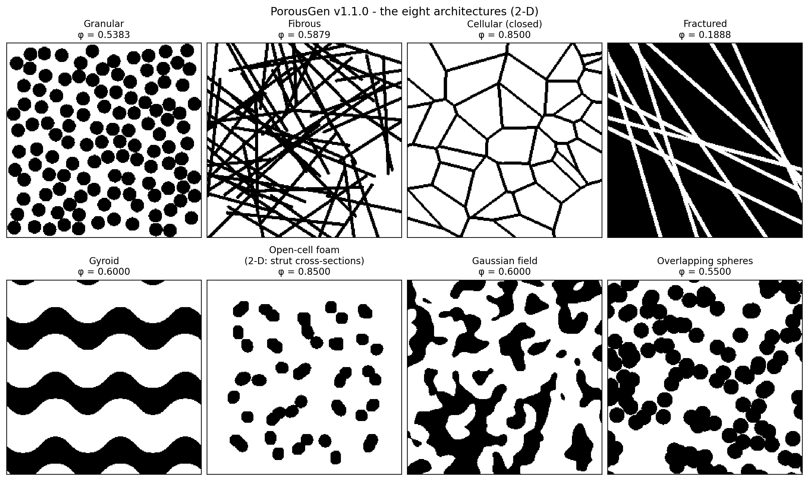

# PorousGen

**LBM-ready porous-media geometry generator** — eight canonical architectures,
exact porosity control, optional periodic (tileable) representative volumes,
structural/topological metrics, and one-call export of everything a
lattice-Boltzmann simulation needs.

[](https://github.com/pooriya1994/porousgen/actions/workflows/tests.yml)

Developed at the **Applied Multi-phase Fluid Dynamics Laboratory**,
Iran University of Science and Technology (IUST), Tehran, Iran.

| Authors | |
|---|---|
| **Pooriya Ghorbani** (developer) | AMFD Lab, IUST — p_ghorbani@mecheng.iust.ac.ir |
| **Majid Siavashi** (corresponding) | Associate Professor, AMFD Lab, IUST — msiavashi@iust.ac.ir |



## Geometry catalogue

| Generator | CLI | Algorithm | Porosity control | Boundary treatment |
|---|---|---|---|---|
| `generate_granular` | `granular` | Random Sequential Addition of hard spheres/discs, mono- or polydisperse | indirect (count, radii) | wall-confined (default) or `periodic=True` |
| `generate_fibrous` | `fibrous` | random capsule fibres (spherocylinders) | **exact** when `porosity=` given, else count/radius | clipped (default) or `periodic=True` |
| `generate_cellular` | `cellular` | Voronoi **face** network (closed cells) | **exact** with `target_porosity=`, else wall thickness | free (default) or `periodic=True` |
| `generate_consolidated` | `fractured` | solid matrix with planar fractures | **exact** when `porosity=` given, else count/aperture | non-periodic only |
| `generate_ordered_gyroid` | `gyroid` | Gyroid TPMS sheet | **exact** | intrinsically periodic when the box holds whole unit cells |
| `generate_open_foam` | `foam` | Voronoi **strut** (edge) network, jittered-lattice seeds | **exact** | free (default) or `periodic=True` |
| `generate_blob` | `blob` | thresholded Gaussian random field | **exact** | free (default, stationary up to the faces) or `periodic=True` |
| `generate_overlapping_spheres` | `spheres` | Boolean model (Poisson centres) | **exact** | free (default) or `periodic=True` |

`porousgen list` prints the same table; it is also available programmatically
as `porousgen.GENERATOR_INFO`.

**Exact** means exact by construction, not by tuning: every porosity-driven
generator builds a scalar field (distance to a skeleton, field value, …) and
a count-selection rule marks exactly `k = round((1-φ)·N)` voxels as solid.
Voxels tied at the cut-off value are ranked by a smooth, seeded random field,
so the partially filled outermost layer forms coherent patches instead of
single-voxel roughness. The
number of fluid voxels therefore equals `round(φ·N)` to within one voxel for
every grid size, target and seed; the test suite checks 1,080 geometries,
including odd grids and targets from 0.02 to 0.9873.

**Boundary conventions.** `periodic=False` (the default everywhere) means
free boundaries: a domain face is never treated as part of the structure.
`periodic=True` builds a periodic representative volume in which every
distance — nearest seed, distance to a skeleton, fibre and sphere
placement — follows the minimum-image convention, so the geometry tiles
seamlessly and suits periodic lattice-Boltzmann boundary conditions.
Fractures (infinite planes of arbitrary orientation) cannot in general be
made periodic, so the fractured type has no periodic mode.

## What a run writes

```
<name>.dat            voxel geometry, plain text: 0 = fluid, 1 = solid
<name>.stl            watertight surface mesh of the solid phase (3-D)
<name>.png            rendered preview
<name>_info.txt       grid, exact voxel counts, porosity, <numDomain>/<domain>
                      XML, generator parameters, realised generation details
<name>_metrics.json   structural metrics (with --metrics / metrics=True)
```

**`.dat` format** — a *plain-text* (UTF-8) file, tab-separated. 2-D: `nx`
rows of `ny` values. 3-D: `nx` blocks of `ny` rows of `nz` values, blocks
separated by one blank line; read slice by slice with a whitespace-delimited
`>>` loop in C++ (see `export_palabos`). `read_palabos()` reads it back.

**`.stl` scope** — coordinates in physical units (`domain_size`); the solid is
capped at the domain faces so the mesh is watertight. The mesh reproduces the
voxel geometry including its staircase: use it for visualisation, 3-D
printing or as input to a surface-meshing tool. It is not a smoothed,
body-fitted CFD mesh; for lattice-Boltzmann codes the `.dat` file is the
simulation input.

## Structural metrics

Exact porosity alone does not show that a geometry is physically meaningful.
`compute_metrics()` (or `--metrics`, or `porousgen analyze file.dat`) reports:

* exact fluid/solid voxel counts and porosity;
* **connectivity** — fluid clusters, porosity of the fluid that percolates from
  the inlet to the outlet face along the flow axis, inlet-accessible porosity,
  isolated-pore fraction; solid clusters and the fraction of solid in the
  largest cluster (floating fragments);
* **topology** — Euler characteristic of the fluid phase;
* **specific surface area** — marching-cubes estimate and voxel-face estimate;
* **pore-size and strut/wall-thickness distributions** — local thickness
  (largest inscribed sphere), d10/d50/d90, and the fraction of each phase
  thinner than 3 voxels, a flag for under-resolution.

Every metric is validated against analytic cases in `tests/test_metrics.py`
(sphere area, disc perimeter, slab width, torus topology, enclosed cavity).

## Install

```bash
pip install .            # Windows x64 / Linux / macOS, Python >= 3.9
pip install ".[test]"    # plus the test suite
```

The console command is lower-case **`porousgen`** (commands are case-sensitive
on Linux and macOS). If it is not on your PATH — common on Windows with the
Microsoft Store Python — `python -m porousgen.cli` is an exact equivalent.
Standalone Windows executable (no Python required): see
[WINDOWS_BUILD.md](WINDOWS_BUILD.md).

## Quick start

```bash
porousgen foam    --resolution 128 --porosity 0.90 --cells 6 --out my_foam
porousgen foam    --resolution 128 --porosity 0.90 --cells 6 --periodic --metrics --out rve
porousgen fibrous --resolution 128 --fibers 150 --porosity 0.85 --out felt
porousgen blob    --resolution 256 --dim 2 --porosity 0.60 --corr 0.08 --out soil
porousgen analyze my_foam.dat --size 0.002
```

```python
from porousgen import generate_open_foam, export_all, compute_metrics

L = (2e-3,) * 3                                     # physical box [m]
g, info = generate_open_foam((128,) * 3, domain_size=L, porosity=0.90,
                             n_cells=6, periodic=True, return_info=True)
export_all(g, "my_foam", domain_size=L, info=info, metrics=True)
```

Length parameters (`radius`, `fiber_length`, `correlation_length`,
`wall_thickness`, …) are in the same units as `domain_size`.

A browser-based parameter builder is included at `ui/porous_media_ui.html`.
Open it locally: it shows a fast, illustrative 2-D preview and composes the
matching Python call; the geometry itself is always produced by the Python
package.

## Testing and reproducibility

```bash
python -m pytest            # about a minute on one CPU core
```

* `tests/test_exact_porosity.py` — integer voxel-count exactness campaign;
* `tests/test_periodic.py` — minimum-image distances against brute force, and
  seam tests showing periodic geometries tile without a seam (with
  non-periodic controls showing that the test detects one);
* `tests/test_metrics.py`, `tests/test_export.py`, `tests/test_cli.py`;
* `tests/test_reference.py` — regression against the committed reference
  outputs in `tests/reference/` (regenerate deliberately with
  `python tools/make_reference.py`).

Continuous integration runs the suite on Linux, Windows and macOS with Python
3.9 and 3.12 (`.github/workflows/tests.yml`).

The scripts that regenerate every geometry in the accompanying article, and
the simulation set-up used for its lattice-Boltzmann results, are in
[`reproducibility/`](reproducibility/).

## Performance

`benchmarks/benchmark.py` measures wall time and peak memory for every
generator from 64³ to 512³ voxels (each case in a fresh process) and records
the hardware and library versions:

```bash
python benchmarks/benchmark.py --sizes 64 128 256 512
```

## Versions and citation

Releases are tagged (`vX.Y.Z`) and archived on Zenodo; see
[CHANGELOG.md](CHANGELOG.md) and [RELEASING.md](RELEASING.md). Cite the
version you used — see [CITATION.cff](CITATION.cff). License: MIT.
